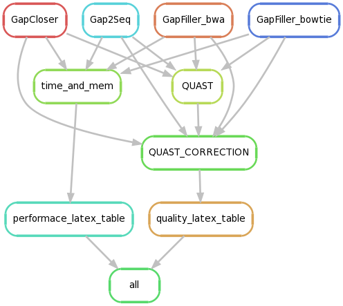

# eval_Gap2Seq

Evaluates gapfilling programs. This evaluation pipeline uses [snakemake](https://bitbucket.org/johanneskoester/snakemake/wiki/Home), that requires python 3.x. Since most systems default to python2.X virtualenvs is the most convenient solution. To run this evaluation, we need both python2.x and python3.x. 

### Installation
Install [pyenv](https://github.com/yyuu/pyenv) through the automatic installer [pyenv-installer](https://github.com/yyuu/pyenv-installer). This is just to be able to have both puthon 2 and 3 available.

Then run 

    $ pyenv install 3.4.1

Now you have python 3.4.1 available through pyenv. Now install snakemake through pip3 or clone repository (see [install_snakemake](https://bitbucket.org/johanneskoester/snakemake/wiki/Documentation#markdown-header-installation))

### Preliminaries

We assume that you have Gap2Seq, GapCloser and GapFiller installed and in path (callable in terminal). Gap2Seq and GapCloser are binaries and can be naturally placed in any folder that you have in SYSPATH. For GapFiller, e.g. use the following code and name the script GapFiller and place it in you path 
     
     #!/bin/bash
     for arg in "$@"; do
     args="$args $arg"
     done
     
     perl /home/kris/source/GapFiller_v1-10_linux-x86_64/./GapFiller.pl $args

### Running snakemake

In the current shell, run

    $ pyenv shell 3.4.1

to activate python 3 in the current shell. **Make sure the paths in the config.json file are correct**. Now run,

    $ snakemake run_gapfillers

to build the gapfilled fasta files. This will set of experiments for all tools specified in the config.json file. To run on a subset of tools or datasets, change the config file lines specifying this, i.e.

     "DATASETS" : [ "staph", "rhodo", "hs14"],
     "GAPFILLERS" :["GAP2SEQ", "GAPFILLER_BWA", "GAPFILLER_BOWTIE", "GAPCLOSER"],

To rerun a specific "rule" e.g. gap2seq, GapFiller_bwa or QUAST, run

    $ snakemake -R QUAST 

To see a flowchart of the pipeline, run 

    $ snakemake --dag | dot -Tpdf > dag.pdf

Dry run can be performed by adding the parameter -n.

Current pipeline:

### On a cluster with slurm job scheduler.

The config.json file supports submitting several jobs on different cores/nodes simultaneously through the slurm job scheduler. Run
     snakemake --debug --keep-going -j 999 --latency-wait 30 --cluster "sbatch -A {params.account} -p {params.partition} -n {params.n}  -t {params.runtime} -C {params.memsize} -J {params.jobname} --mail-type={params.mail_type} --mail-user={params.mail}" run_scaffolders

To create one job for each separate run. Snakemake also supprts the job schedulrer "qsub" see 
[snakemake documentation](https://bitbucket.org/johanneskoester/snakemake/wiki/Documentation).

